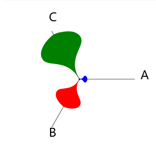

# Flowerglyph as SVG 

A simple flowerglpyh svelte component that can be used as svg element.

Example usage:
````svelte
<svg width=200 height=200>
    <FlowerGlyphs 
        x_pos=100
        y_pos=100
        categories={["A", "B", "C"]}
        values={[10, 40, 65]}
        colors={["blue", "red", "green"]}
        radius_fn={value => Math.max(0, Math.min(1, value / 70))}
        width_fn={value => Math.max(0.1, Math.min(1, value / 70))}
        base_radius=70 
        base_width=30>
    </FlowerGlyphs>
</svg>
````

Which then looks like this:



